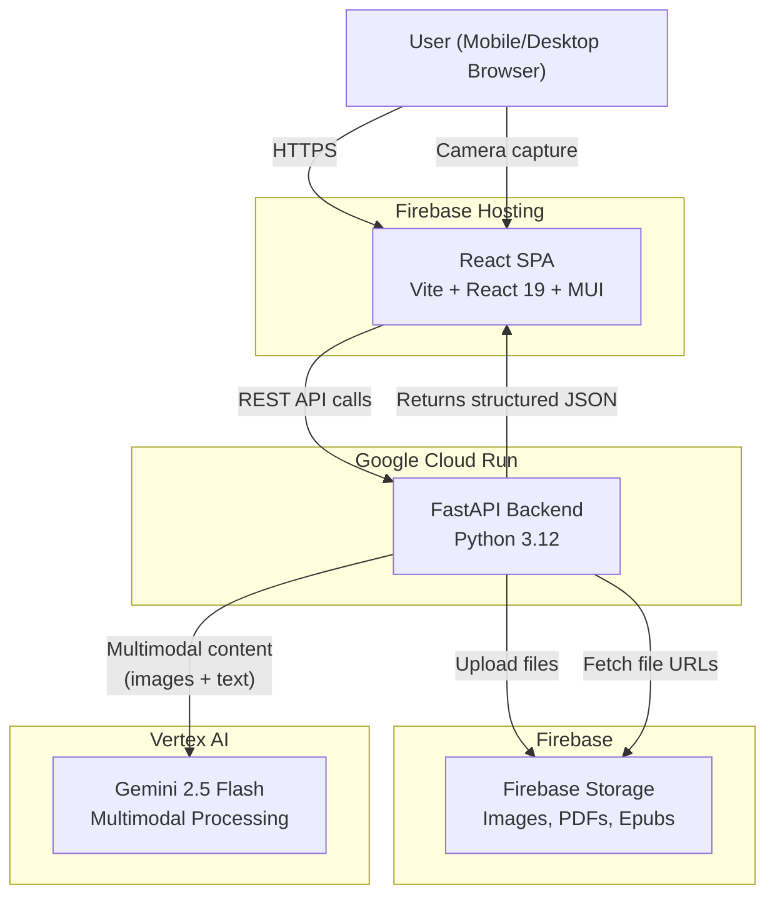
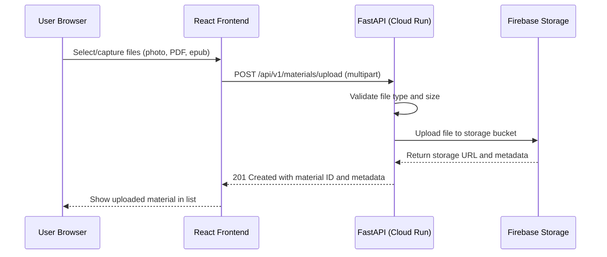
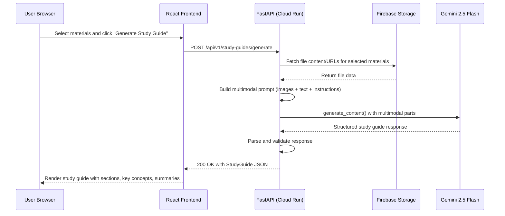
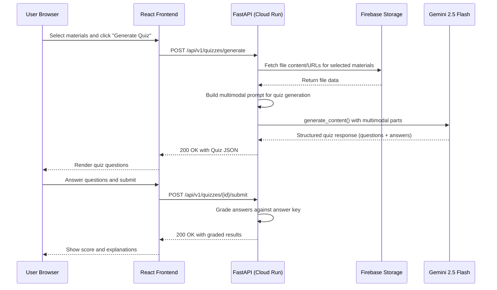

# Architecture -- Vision-First Study Buddy

## High-Level Service Architecture



## Flow Summary

### Material Upload Flow



### Study Guide Generation Flow



### Quiz Generation and Submission Flow



## Tech Stack

| Service | Technology | Version | Rationale |
|---------|-----------|---------|-----------|
| **Backend API** | FastAPI | 0.115+ | Async-first Python framework with built-in OpenAPI docs, Pydantic integration, and native multipart file upload support |
| **Runtime** | Python | 3.12 | Stable release with full ecosystem support for google-cloud-aiplatform and firebase-admin SDKs |
| **LLM Access** | Vertex AI SDK (`google-cloud-aiplatform`) | latest | Official Google SDK for Vertex AI with native support for multimodal content (images, PDFs) and structured output |
| **LLM Model** | Gemini 2.5 Flash | `gemini-2.5-flash` | Native multimodal understanding (images, PDFs); 1M token context window enables processing multiple documents without chunking; fast inference and low cost |
| **File Storage** | Firebase Storage | N/A | CDN-backed object storage with simple upload/download APIs; integrates with Firebase Admin SDK for server-side access |
| **Frontend** | React | 19.x | Component-based UI with hooks for state management; broad ecosystem for camera/file APIs |
| **UI Framework** | MUI (Material UI) | 6.x | Pre-built accessible components (cards, buttons, dialogs, file inputs); responsive grid system for mobile-first design; built-in dark mode support |
| **Frontend Tooling** | Vite | 6.x | Fast dev server with HMR; optimized production builds; first-class React support |
| **Frontend Hosting** | Firebase Hosting | N/A | CDN-backed static hosting with custom domain support; co-located with Firebase Storage |
| **Container Runtime** | Cloud Run | N/A | Serverless containers with automatic scaling; native IAM for Vertex AI and Firebase access |
| **Containerization** | Docker | N/A | Standard OCI container for reproducible builds and Cloud Run deployment |
| **Data Validation** | Pydantic | 2.x | Schema enforcement for API request/response models; used by FastAPI natively |

## Key Design Decisions and Trade-offs

### 1. Gemini Native Vision vs. Separate OCR Pipeline

**Decision:** Use Gemini 2.5 Flash's built-in multimodal understanding instead of a dedicated OCR service (e.g., Google Cloud Vision API, Tesseract).

**Rationale:** Gemini 2.5 Flash natively accepts images and PDFs as input content parts. Rather than running OCR to extract text and then sending that text to an LLM, we send the raw images directly. This has several advantages: (a) Gemini understands spatial layout, diagrams, and annotations that pure OCR would lose, (b) fewer services to manage and pay for, (c) the model can reason about visual elements (arrows, underlines, diagrams) alongside text. The trade-off is that Gemini's text extraction may be less precise than dedicated OCR for very messy handwriting, but the holistic understanding compensates.

### 2. Long-Context Processing vs. RAG

**Decision:** Pass all uploaded materials into a single Gemini call using the 1M token context window, rather than implementing a retrieval-augmented generation (RAG) pipeline with embeddings and vector search.

**Rationale:** For the typical student use case (5-20 pages of notes, a few textbook chapters), the total content fits well within Gemini's context window. This eliminates the need for an embedding model, vector database, chunking strategy, and retrieval logic -- reducing architectural complexity significantly. The trade-off is that very large document sets (hundreds of pages) may exceed the context window or increase latency, but this is an acceptable limitation for a study tool.

### 3. Firebase Storage for File Hosting

**Decision:** Store uploaded files in Firebase Storage rather than Cloud Storage (GCS) directly.

**Rationale:** Firebase Storage provides a simpler SDK for both server-side (Firebase Admin) and client-side operations. It includes built-in CDN distribution, security rules, and integrates cleanly with the Firebase Hosting frontend. The underlying infrastructure is GCS, so there is no performance trade-off. Firebase Storage also provides signed URLs for temporary access, which is useful for passing file references to the Gemini API.

### 4. MUI for Mobile-First Design

**Decision:** Use Material UI (MUI) instead of a custom CSS framework or Tailwind CSS.

**Rationale:** MUI provides a comprehensive set of pre-built, accessible components that follow Material Design guidelines. The responsive grid system and breakpoint utilities make mobile-first development straightforward. Built-in dark mode support via the theme provider reduces custom CSS. For a study tool that students will primarily use on their phones, the native-feeling Material Design components (FABs, bottom sheets, cards) create a familiar mobile experience.

### 5. No Database

**Decision:** No persistent database. Materials are stored in Firebase Storage; generated study guides and quizzes are returned to the client and not persisted server-side.

**Rationale:** This is a portfolio project focused on demonstrating multimodal AI capabilities. Adding Firestore would increase complexity without showcasing new engineering patterns. If persistence is needed later (saving quiz history, tracking study progress), a Firestore collection can be added without architectural changes.

### 6. Synchronous Generation (No Job Queue)

**Decision:** Study guide and quiz generation are synchronous API calls rather than async jobs with polling.

**Rationale:** Gemini 2.5 Flash is fast (typically 5-15 seconds for study guide generation). A synchronous request-response pattern is simpler to implement and test. The frontend shows a loading state during generation. If generation times increase (e.g., processing very large document sets), the architecture can be extended to use Cloud Tasks or Pub/Sub for async processing without changing the API contract.

## Project Source Code Structure

### Backend (`/backend`)

```
backend/
  Dockerfile
  requirements.txt
  .env.example
  app/
    __init__.py
    main.py                         # FastAPI app factory, CORS config, router mounting
    config.py                       # Settings via pydantic-settings (project ID, bucket, model)
    routers/
      upload.py                     # POST /api/v1/materials/upload
      materials.py                  # GET /api/v1/materials, GET /api/v1/materials/{id}
      study_guides.py               # POST /api/v1/study-guides/generate, GET /api/v1/study-guides/{id}
      quizzes.py                    # POST/GET /api/v1/quizzes endpoints
      health.py                     # GET /api/v1/health
    models/
      requests.py                   # Pydantic models for API request bodies
      responses.py                  # Pydantic models for API response bodies
      schemas.py                    # Shared data schemas (Material, StudyGuide, Quiz, etc.)
    services/
      material_processor.py         # File validation, metadata extraction, content preparation
      study_guide_generator.py      # Orchestrates study guide prompt building + Gemini call
      quiz_generator.py             # Orchestrates quiz prompt building + Gemini call
      gemini_client.py              # Wraps Vertex AI SDK initialization and multimodal generate calls
      storage_client.py             # Firebase Storage upload, download, URL generation
    prompts/
      study_guide_template.txt      # System instruction template for study guide generation
      quiz_template.txt             # System instruction template for quiz generation
  tests/
    __init__.py
```

### Frontend (`/frontend`)

```
frontend/
  index.html
  package.json
  vite.config.js
  public/
  src/
    main.jsx                        # React entry point
    App.jsx                         # Root component with MUI ThemeProvider and routing
    theme.js                        # MUI theme configuration (light/dark mode)
    api/
      client.js                     # Fetch wrapper for backend API calls
    components/
      MaterialUpload.jsx            # Drag-and-drop + file picker upload component
      MaterialList.jsx              # Grid/list of uploaded materials with thumbnails
      StudyGuideView.jsx            # Rendered study guide with sections and highlights
      QuizView.jsx                  # Interactive quiz with question cards and answer inputs
      CameraCapture.jsx             # Camera integration for snapping photos of notes
      TopNav.jsx                    # App bar with navigation and dark mode toggle
    pages/
      HomePage.jsx                  # Landing page with upload CTA and recent materials
      MaterialsPage.jsx             # Material management and selection view
      StudyGuidePage.jsx            # Study guide generation and display
      QuizPage.jsx                  # Quiz generation, taking, and results
    hooks/
      useUpload.js                  # Custom hook for file upload with progress tracking
      useStudyGuide.js              # Custom hook for study guide generation with loading state
      useQuiz.js                    # Custom hook for quiz generation and submission
    styles/
      global.css                    # Global styles, CSS variables, font imports
```
